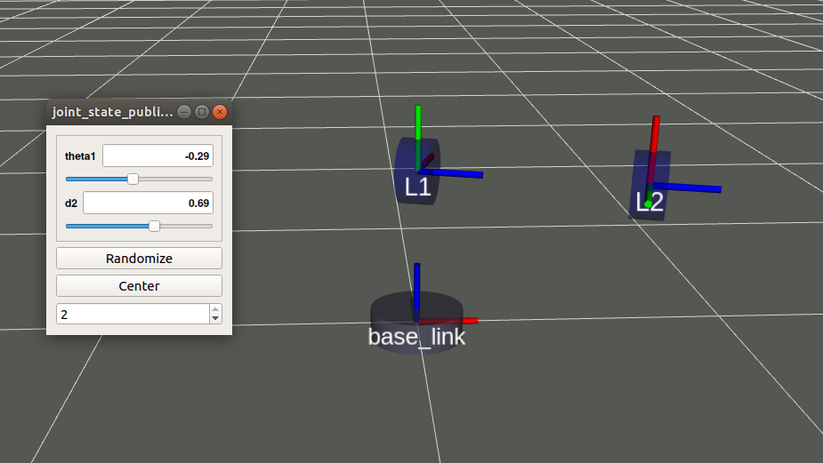
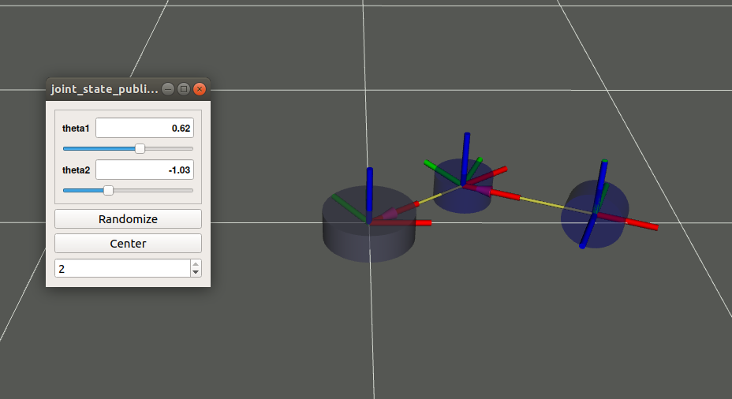

# Manipulators description

This package contains two very basic manipulators:
* Theta-rho manipulator has 1 angular DoF and 1 prismatic DoF.
  


* Theta-theta manipulator has 2 angular DoFs.



## Install

To run the package you have to download it inside your `catkin_ws/src` folder. You can use:

```bash
~catkin_ws/src $ git clone https://github.com/narcispr/manipulators_description.git
```
or just download the ZIP file and uncompress it in `catkin_ws/src` folder. Notice that the name must be `manipulators_description`!

Once you have the package downloaded it is a good habit run the `catkin_make` command (from the root of your workspace) to check if something has to be compiled or generated.

```bash
~catkin_ws $ catkin_make
```

or if you use the catkin build tools use

```bash
~catkin_ws $ catkin build
```

## Visualize the manipulators

This package do not contain any piece of code just the URDF files and a launch. To execute it run the following command:

```bash
$ roslaunch manipulators_description view_theta_theta.launch
or
$ roslaunch manipulators_description view_theta_rho.launch
```

By default, the launch file runs the node `joint_state_publisher_gui` that allows you to move the manipulator manually. However, if you want to run your own controller (anything publishing `/joint_state` messages) firts comment this node in the launch file.

## Kinematics 

### Denavit-Hartenberg parameters

* Theta-rho:
  
| DoF  | theta_i | d_i  | a_i​  | alpha_i​ |
| ---- | ------- | ---- | ---- | ------- |
| 1    | theta_1 | 0.5  | 0.0  | Pi/2    |
| 2    | Pi/2​    | d_2  | 0.0  | 0.0     |

* Theta-theta
  
| DoF  | theta_i | d_i  | a_i​  | alpha_i​ |
| ---- | ------- | ---- | ---- | ------- |
| 1    | theta_1 | 0    | 0.40 | 0       |
| 2    | theta_2​ | 0    | 0.45 | Pi/2    |

