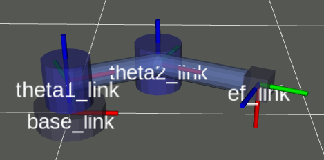

# Theta-Theta manipulator

The theta-theta manipulator has 2 angular DoFs connected by two links as shown in the next figure.

## Kinematics 

### Denavit-Hartenberg parameters 

| $DoF$ | $\theta_i$ | $d_i$ | $a_i$ | $\alpha_i$ |
| ----- | ---------- | ----- | ----- | ---------- |
| 1     | $\theta_1$ | 0     | 0.40  | 0          |
| 2     | $\theta_2$ | 0     | 0.45  | $\pi$/4    |

###  $^RT_H$ matrix

$$
^RT_H = 
\left( 
\begin{array}{cccc}
\cos_{12} & 0 & \sin_{12} & a_2 \cos_{12} + a_1 \cos_1\\
\sin_{12} & 0 & -\cos_{12} & a_2 \sin_{12} + a_1 \sin_1\\
0 & 1 0 & 0 \\
0 & 0 & 0 & 1
\end{array}
\right) =
\left( 
\begin{array}{cccc}
n_x & s_x & a_x & p_x\\
n_y & s_y & a_y & p_y\\
n_z & s_z & a_z & p_z \\
0 & 0 & 0 & 1
\end{array}
\right)
$$

### Inverse kinematics

$$
\theta_1 = \text{atan2}(\frac{p_y - a_2 a_x}{p_x + a_2 a_y})\\
\theta_2 = \text{atan2}(\frac{n_y}{n_x}) - \theta1
$$

