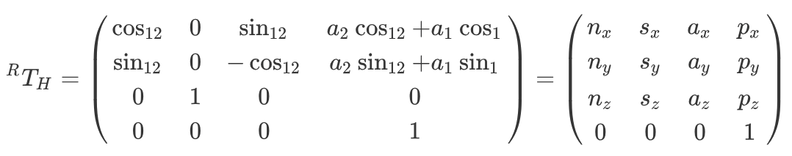
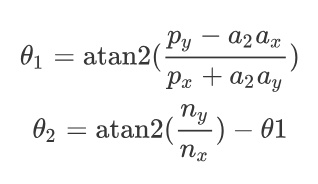

# Theta-Theta manipulator

The theta-theta manipulator has 2 angular DoFs connected by two links as shown in the next figure.

## Kinematics 

### Denavit-Hartenberg parameters 

| DoF  | theta_i | d_i  | a_i​  | alpha_i​ |
| ---- | ------- | ---- | ---- | ------- |
| 1    | theta_1 | 0    | 0.40 | 0       |
| 2    | theta_2​ | 0    | 0.45 | Pi/4    |

###  rTh matrix

### Inverse kinematics

